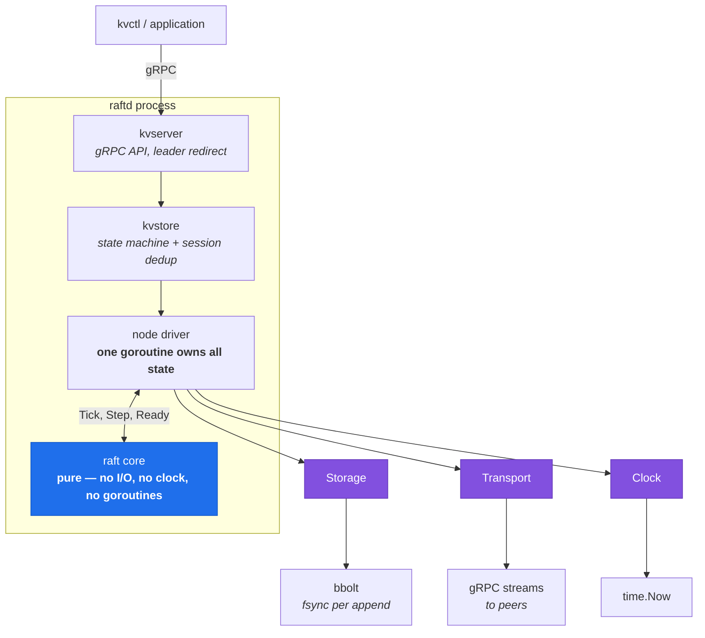
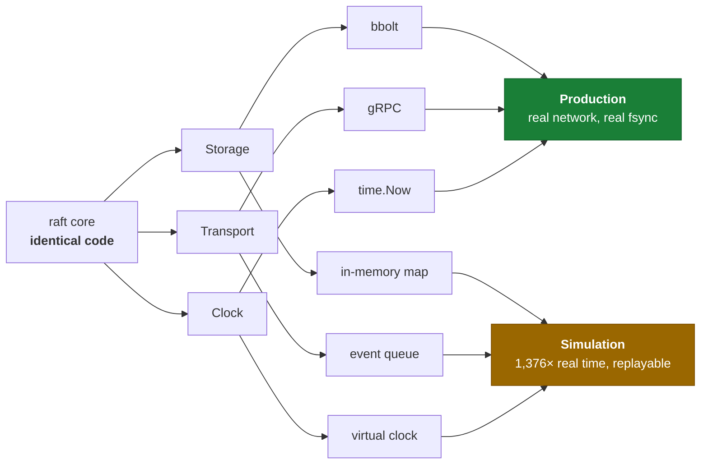
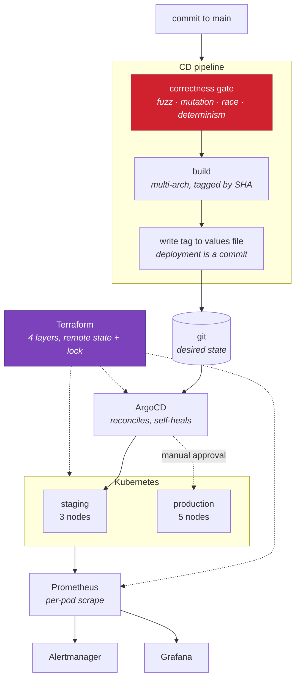

<div align="center">

# Distributed KV Store with Raft + Deterministic Simulation Testing

**A linearizable key/value store on hand-written Raft — verified by a deterministic simulator that replays any failure from a single integer.**

[](https://github.com/sAchin-680/Distributed-KV-Store-with-Raft-Deterministic-Simulation-Testing/actions/workflows/ci.yml)
[](https://github.com/sAchin-680/Distributed-KV-Store-with-Raft-Deterministic-Simulation-Testing/actions/workflows/cd.yml)


[Overview](#overview) · [System design](#system-design) · [Verification](#verification) · [Performance](#performance) · [Operations](#production-operations) · [Getting started](#getting-started) · [Docs](#documentation)

</div>

---

## Overview

Raft implemented from the paper — leader election, log replication, snapshotting and joint-consensus membership changes — with a linearizable key/value store on top.

The part that matters is what surrounds it. A **deterministic simulation framework** controls time and the network, injects partitions and crashes from a seeded random source, and reproduces any execution exactly. When a randomized run finds a safety violation it prints one number, and that number is enough for anyone to replay the identical failure, byte for byte, indefinitely.

Everything below was measured, not estimated.

| | |
| --- | --- |
| Simulation campaign | **10,000 seeds**, 1.7 billion events, 83 simulated hours in under 4 minutes, **0 safety violations** |
| Real consensus bugs found | **4**, each replayable from a single integer |
| Seeded-bug detection | **22 / 22** — the mutation gate that found 3 decorative tests |
| Rolling upgrade under load | 138,129 ops, **0.0116% unknown**, history linearizable |
| Quorum-loss alerting | fired in **30s**, cleared in **10s**, unattended |
| GitOps drift correction | **1–2s**, verified by breaking a live cluster |
| Commit throughput (core) | **647k/sec** on 3 nodes, 320k/sec on 5 |

---

## System design

Three interfaces are the entire design. The consensus core has no clock, no goroutines, no network and no disk: time arrives as `Tick()` calls, messages are plain values, and persistence goes through an interface.



Swap what sits beneath those three seams and the **same consensus code** runs either as a real distributed system or inside a single-threaded simulator, where a ten-second scenario completes in milliseconds:



### Why it is built this way

**Determinism is architectural, not a testing technique.** A core that calls `time.Now()` or dials gRPC gives a simulator nothing to control. The core is pure from the first commit, and [`scripts/check-determinism.sh`](scripts/check-determinism.sh) fails CI if a clock, a goroutine, a channel or a package-level `math/rand` ever appears inside it.

**One goroutine owns all Raft state.** Not a mutex around shared state — a single goroutine that is the only thing permitted to touch it. Most broken Raft implementations are broken by data races rather than by the algorithm; this structure makes that category unrepresentable.

**The hard parts are not skipped.** Joint consensus for membership changes, the current-term-only commit rule, read-index for linearizable reads, and session-based deduplication so retried writes cannot corrupt the client-visible history. These are the details that separate a working Raft from a plausible one.

---

## Verification

Four layers, each catching what the others structurally cannot.

| Layer | Catches | Blind to |
| --- | --- | --- |
| Unit tests on the pure core | Algorithm logic, log-boundary edge cases | Anything emergent from interleaving |
| Deterministic simulation | Rare interleavings, partition and crash races, safety violations in internal state — **reproducibly** | Bugs in gRPC wiring, bbolt usage, serialization |
| Real chaos + [Porcupine](https://github.com/anishathalye/porcupine) | The gap between model and implementation; client-visible linearizability | Rare interleavings — it cannot replay a failure |
| Metrics and alerting | Behaviour at real scale and duration | Correctness, directly |

The simulator proves the *algorithm* under adversarial scheduling. The chaos rig proves the *implementation* under real gRPC deadlines, real fsyncs and real OS scheduling. Neither is redundant; each covers the other's blind spot.

> A longer treatment — why ordinary testing is structurally insufficient for consensus, and what each of the four real bugs looked like — is in **[docs/what-the-simulator-catches.md](docs/what-the-simulator-catches.md)**.

### The simulation campaign

```console
$ simctl fuzz --count=10000
fuzzing seeds 1..10000 across 12 workers (5 nodes, 30000ms virtual each)
ran 10000 seeds in 4m2.867s (41 seeds/sec, 13535461 entries committed,
                             2092853788 events)
no safety violations
```

| | |
| --- | --- |
| Seeds | 10,000 |
| Simulated events | 1,713,783,733 |
| Entries committed | 12,257,429 |
| Cluster time simulated | **83.3 hours in 3m38s** — 1,376× real time |
| Safety violations | **0** |

Every feature is exercised throughout rather than mentioned. A typical thirty-second run takes **100+ snapshots**, transfers ~70 of them to followers that fell behind the start of the leader's log, and performs **~9 membership changes** — all while partitioning, crashing and restarting nodes.

Checked after every single event: at most one leader per term, no committed entry ever changes, commit index never decreases, applied never exceeds committed. At the end of each run: log matching pairwise across all nodes, and no two nodes having applied a different command at the same position.

### One integer reproduces any failure

```console
$ for i in 1 2 3; do simctl run --seed=2; done
169359 events in 72.578ms (30000ms virtual), 1146 entries committed across
  7 leader terms, 15 crashes, 14 restarts, 10 partitions, 102 snapshots taken,
  41 sent, 4 membership changes, 77639 msgs (3523 dropped, 1482 duplicated),
  trace 26c664211d16bfc0
169359 events in 71.143ms ... trace 26c664211d16bfc0
169359 events in 72.652ms ... trace 26c664211d16bfc0
```

Identical event count and identical trace hash on every run. The wall-clock time differs because it is the only thing not simulated.

A *failure* is pinned the same way. Seeds that once failed now pass, so the demonstration uses the negative control — durability deliberately broken, which **must** produce violations:

```console
$ for i in 1 2 3; do simctl run --seed=27 --disk-loss=0.5; done
safety violation [committed-entries-never-change] at t=26106ms (seed 27):
  committed index 119 changed: node 1 committed term 1 (8488d043) at t=2520ms,
  node 3 now has term 3 (c38200e5)
```

The same violation, at the same index, at the same millisecond, every time, on any machine. Add a print statement and it reappears with the print statement in it. **A randomized test that cannot do this reports failures nobody can act on.**

### The four bugs it found

Enabling snapshotting made the simulator fail within the first twenty seeds. Three were real defects, each only reachable once compaction existed:

| Bug | Why it hid | Consequence |
| --- | --- | --- |
| A delayed `AppendEntries` below the commit index was scanned for conflicts | Before compaction the scan could verify the old entries and correctly found none | An entry that is merely *unknown* is reported as *conflicting*, and the node refuses it as an attempt to overwrite its committed prefix |
| The bbolt store conflated the log floor with the snapshot boundary | They are the same until a leader keeps a tail of entries past the snapshot | `Compact` decides it has already run and silently does nothing — the log grows for ever behind a snapshot that claimed to have shortened it |
| A node restarting never restored its state machine from its own snapshot | Without compaction, a restart replays the whole log and gets there anyway | The node comes back holding a fraction of its state, silently |

The first was reported as **seed 188** and reproduced exactly from that integer throughout diagnosis. A fourth, found earlier: a refused pre-vote replied with the *hypothetical* term it had been asked about, so a node declining to disrupt the cluster handed the candidate exactly the inflated term pre-vote exists to prevent. All four are now regression-tested and seeded into the mutation suite.

A fifth failure — eleven seeds reporting state machine divergence — turned out to be the simulator's own model, not a Raft defect. Recorded as such rather than counted as a find.

### The checker is validated against a real violation

Ten thousand clean runs prove nothing until the instrument is shown to detect what it is looking for. A checker that never fires is indistinguishable from a broken one.

Raft's safety argument assumes a node's term and vote survive a crash. `--disk-loss` removes that assumption, which **must** produce two leaders in a term and therefore overwritten committed entries. It does — **7 failing seeds out of 41** — caught two independent ways: the simulator's checker spotting a changed committed entry, and the core's own append path refusing to overwrite its committed prefix.

### Chaos and linearizability

The simulator replaces gRPC with an in-memory queue, bbolt with a map, and the Go scheduler with a single-threaded loop. Bugs in any of those are invisible to it. This closes that gap.

Five containers, `tc`/`netem` applying 60ms ±40ms delay, 3% loss and 5% reordering, three `iptables` partitions and two `SIGKILL`s on a schedule, while ten concurrent clients drive the store. Every operation's invocation, completion and result is recorded, and the history is checked with Porcupine: *could a single machine, executing these one at a time, have produced these answers?*

| Run | Clients | Operations | Unknown outcome | Result |
| --- | --- | --- | --- | --- |
| 1 | 10 | 3,835 | 326 (8.5%) | undecided |
| 2 | 10 | 3,471 | 325 (9.4%) | linearizable |
| 3 | 10 | 3,327 | 309 (9.3%) | linearizable |
| 4 | 5 | 341 | 116 (34%) | linearizable |

**Operations whose outcome the client never learned are kept**, not discarded. A write that timed out may have committed anyway — the *answer* was lost, not necessarily the command — so it is recorded as invoked-and-never-returned and the checker is free to place it either way. Dropping them would remove exactly the operations most likely to be involved in a violation.

**An inconclusive search is not a pass.** Porcupine's search is exponential in concurrent operations; when it runs out of time the result is `UNKNOWN` and `chaosctl` exits non-zero. Run 1 above is recorded as undecided, not as a pass.

**The first runs failed, and the harness was at fault.** Reads returned values absent from that run's history — written by the *previous* run, because container volumes persist. The checker was right; the history was not self-contained. Fixed by namespacing each run's keys, and [written up in full](docs/chaos-runs/) rather than quietly corrected.

### Mutation testing

`make mutation` seeds **22 known Raft bugs** — the classic ones, including Figure 8 and index-first log comparison — and checks that the test named after each one actually fails. It runs in 2.2s and gates CI.

A passing test proves nothing until you have watched it fail. This caught **three decorative tests**: tests that passed even with the bug they were named after present. One example — the pre-vote lease test left `LastLogIndex` at zero, so the election restriction was doing the refusing and the lease check could have been deleted without the test noticing.

---

## Performance

Core-only numbers: no disk, no network, no goroutines. They say how much headroom the algorithm leaves, not what a cluster sustains — a real deployment is bounded by fsync and network round trips. Apple M4 Pro, Go 1.25.1, median of 3 runs. Reproduce with `make bench`.

| | |
| --- | --- |
| Commit round, 3-node cluster | 1.55 µs — **647k commits/sec** |
| Commit round, 5-node cluster | 3.13 µs — **320k commits/sec** |
| Steady-state heartbeat, 3-node | 595 ns |
| Leader election from cold start | **12.1 logical ticks** median |
| Statement coverage of the core | 76.5% |
| Test-to-code ratio | 0.98 : 1 |

### What the conflict-hint optimization is worth

Repairing a follower whose log diverged by 200 entries across 2 terms, measured both ways:

| | Round trips | Wall time |
| --- | --- | --- |
| With the §5.3 conflict hint | **6** | 12 µs |
| Backing up one index at a time | 204 | 208 µs |

34× fewer round trips. Those are *network* round trips in a real cluster: at 1ms RTT it is the difference between a 6ms rejoin and a 204ms one.

---

## Production operations



**Everything is downstream of the correctness gate**, and that ordering is deliberate rather than conventional. A consensus bug does not announce itself — it is a stale read served once under a partition that healed, or a committed entry lost in an election nobody noticed. Catching it in staging needs the same unlucky interleaving that hid it in testing, so "deploy and watch" is not the safety net here that it is for a web service.

### Kubernetes

Five nodes as a StatefulSet with per-pod volumes, a headless Service so peers can be addressed individually, and a PodDisruptionBudget set to quorum.

Node identity comes from the pod ordinal, so `kv-raftkv-3` is always node 4, always with the same disk. That is not cosmetic: a Raft node's ID appears in the replicated configuration and its vote and log live on disk, so a node returning as a *different* node would leave the old one permanently unreachable in the configuration. A handful of restarts would put the cluster below quorum against members that no longer exist. [ADR-0004](docs/adr/0004-statefulset-not-deployment.md) works through what a Deployment breaks, one failure at a time.

Two settings are **required rather than preferred**, and both break the same bootstrap cycle — a pod is not Ready until there is a leader, a leader needs a majority, and a majority needs pods. `podManagementPolicy: Parallel` stops the default ordered startup deadlocking at pod 0, and `publishNotReadyAddresses: true` lets peers resolve each other before any of them is Ready.

### A rolling upgrade costs 0.0116% of operations

Every node in a five-node cluster replaced, one at a time, while eight clients drove reads, writes and deletes without pausing.

| | |
| --- | --- |
| Operations | 138,129 in 2m00s (~1,150/sec) |
| Outcome unknown | **16 — 0.0116%** |
| Linearizable | yes, checked in 156ms |
| Pods replaced | 5 of 5, in 161s |
| Cluster after | every node at the same term, commit and applied index |

Sixteen, not zero, and the difference is worth being exact about. Those are the operations already in flight on the leader when its pod was terminated — the client sent them and no answer is coming. Everything else retried against the next endpoint and succeeded. The window is bounded by one election, 1–2s by construction; at this rate a cluster that genuinely stopped serving would have lost thousands rather than sixteen, because four of five nodes hold a majority throughout.

The workload runs *inside* the cluster. A port-forward dies with its target pod, and the resulting errors would be the harness failing rather than the store. [Full account](docs/rollout/).

### The alerts were fired on purpose

An alert rule that has never fired is an assertion, not a safeguard — the expression may not match the metric names, the threshold may be unreachable, the routing may drop it, and none of that surfaces until an incident. So `make monitoring-demo` takes quorum away and checks the alert arrives:

```text
cluster has 5 nodes, quorum is 3
scaling down to 2 — one short of a majority
alerts firing: RaftKVBelowQuorum RaftKVNoLeader      (30s after quorum was lost)
healing: scaling back to 5
alerts cleared; the cluster recovered on its own     (10s after recovery)
```

`RaftKVNoLeader` is expressed as *no node can name a leader*, not as a count of running pods, because those are different questions: five pods can be `Running` and healthy while a partition leaves none able to reach a majority. Kubernetes cannot see that difference. It waits 15s — about ten election timeouts — because a leaderless instant is normal and an alert that fires on routine failover is one people learn to ignore.

Every rule aggregates `by (namespace)`, which is load-bearing rather than tidy: one Prometheus scrapes both environments, so a bare `max(...)` would let a healthy production mask a completely dead staging. Thresholds derive from each cluster's own voter count, so staging needs 2 of 3 and production 3 of 5 without either being written down. [Details](deploy/monitoring/).

### Drift is corrected in two seconds

ArgoCD follows the chart on `main`; nothing is applied by hand. The demo does the realistic damage — scaling the cluster below quorum, which looks reasonable during an incident and quietly leaves it unable to commit:

```text
the chart says 5 nodes; quorum is 3
scaling to 2 by hand — below quorum, exactly the mistake that hurts
detected as OutOfSync after 0s
replica count back to 5 after 2s          final state: Synced / Healthy

deleting the PodDisruptionBudget by hand
PodDisruptionBudget restored after 2s
```

**No alert fired, and that is the result.** `RaftKVBelowQuorum` was armed throughout; it waits 15s, and the drift was gone in 2. Nobody should be paged for something that repaired itself faster than it takes to decide whether it is real. The two thresholds were chosen independently and compose correctly. [Details](deploy/argocd/).

### Terraform, with a demonstrated lock

Four layers — the cluster, the platform, and one per environment — each with its own state, so applying staging cannot reach production or the control plane. State lives in the cluster: a Secret holds it, a `Lease` guards it.

Demonstrated rather than claimed — four concurrent plans, one runs:

```text
  plan 1  acquired the lock and ran
  plan 2  refused by the lock
  plan 3  refused by the lock
  plan 4  refused by the lock
```

The backend lives *inside* the cluster it tracks, so the cluster itself cannot be tracked in it — `bootstrap/` uses local state for exactly that reason. Every setup has this ordering problem and most hide it behind an S3 bucket somebody created by hand years ago; here it is explicit, and the layer holding local state is disposable.

No cloud account is involved, deliberately: an EKS module written and never applied would be the only thing in this repository without a measured result behind it. [Details, including three things it taught by failing](terraform/).

---

## Getting started

```bash
git clone https://github.com/sAchin-680/Distributed-KV-Store-with-Raft-Deterministic-Simulation-Testing.git raftkv
cd raftkv
make check      # fmt, vet, determinism guards, lint, tests, mutation gate
```

Go 1.25+ is the only requirement for building and testing. The rest is needed only to regenerate protobuf code or run the linter:

```bash
brew install protobuf golangci-lint
go install google.golang.org/protobuf/cmd/protoc-gen-go@latest
go install google.golang.org/grpc/cmd/protoc-gen-go-grpc@latest
```

### Run a cluster locally

```bash
# Peer and client traffic get separate ports, so a flood of client requests
# cannot starve the heartbeats that keep the leader in office.
for i in 1 2 3; do
  bin/raftd --id=$i --listen=127.0.0.1:900$i --client-listen=127.0.0.1:800$i \
            --data=./data/$i --tick=50ms \
            --peers=1@127.0.0.1:9001,2@127.0.0.1:9002,3@127.0.0.1:9003 &
done

E=127.0.0.1:8001,127.0.0.1:8002,127.0.0.1:8003
bin/kvctl --endpoints=$E status
bin/kvctl --endpoints=$E set greeting "hello world"
bin/kvctl --endpoints=$E get greeting
bin/kvctl --endpoints=$E --stale get greeting   # skips the leadership check
bin/kvctl --endpoints=$E members 1 2            # names the complete new voter set
```

`kvctl` is given the whole cluster, not one node. Leadership moves on its own schedule, so it follows the redirect and remembers where it ended up:

```text
ENDPOINT         NODE  STATE     TERM  LEADER  COMMIT  APPLIED  LAG
127.0.0.1:8001   1     follower  1     3       1       1        -
127.0.0.1:8002   2     follower  1     3       1       1        -
127.0.0.1:8003   3     leader    1     3       1       1        0
```

Membership changes pass through a **joint configuration** requiring majorities of *both* the old and new voter sets. That overlap is what makes it impossible for the two configurations to elect separate leaders mid-change — the failure a single-step change allows, and the part most from-scratch Raft implementations skip.

---

## Command reference

Everything runs through `make`; `make help` lists every target.

<details>
<summary><b>Build, test and static analysis</b></summary>

```bash
make build                     # all binaries into ./bin
make build VERSION=v0.1.0      # stamp a version into the binaries
make test                      # full suite, race detector on
make test-short                # fast tests only
make cover                     # coverage report -> coverage.html

make check          # everything CI runs
make bench          # consensus-core throughput benchmarks
make mutation       # verify the tests detect the bugs they are named after
make determinism    # assert the core has no clock, goroutines or global rand
make fmt-check
make lint
make proto          # regenerate Go code from proto/*.proto
make proto-check    # fail if checked-in generated code is stale
```

</details>

<details>
<summary><b>Simulation</b></summary>

```bash
make fuzz                       # 1,000 seeds (the CI gate)
make fuzz FUZZ_SEEDS=10000      # the full campaign
make replay SEED=12345          # reproduce one exact execution

bin/simctl run  --seed=12345 --verbose
bin/simctl fuzz --count=10000 --workers=8

# tell an algorithm bug from a fault-handling one
bin/simctl run --seed=12345 --no-faults

# the negative control: break Raft's durability assumption on purpose
bin/simctl fuzz --count=200 --disk-loss=0.5
```

</details>

<details>
<summary><b>Chaos and linearizability</b></summary>

```bash
make chaos-up       # five-node cluster in containers
make chaos-run      # faults and workload together, then check the history
make chaos-check HISTORY=docs/chaos-runs/history-....json
make chaos-heal     # remove every injected fault
make chaos-down
```

</details>

<details>
<summary><b>Kubernetes, GitOps and monitoring</b></summary>

```bash
make kind-up        # local Kubernetes cluster
make deploy         # build, load the image, install the chart
make rollout        # replace every node under load, then check the history
make undeploy

make monitoring-up      # Prometheus, Alertmanager, Grafana
make monitoring-open    # Grafana :3000, Prometheus :9090, Alertmanager :9093
make monitoring-demo    # break quorum, watch the alert fire, heal, watch it clear

make argocd-up      # install ArgoCD, create both Applications
make argocd-status  # what each environment is running
make argocd-demo    # break the cluster by hand, watch it corrected
```

</details>

<details>
<summary><b>Infrastructure</b></summary>

```bash
make tf-bootstrap   # the cluster, and the backend everything else uses
make tf-platform    # ArgoCD and the monitoring stack
make tf-staging     # what staging runs
make tf-production  # what production runs
make tf-lock-demo   # show the state lock refusing concurrent operations
make tf-validate
make tf-destroy
```

</details>

---

> The diagrams above are Mermaid, rendered by GitHub from the source in this file, so they cannot drift from what is committed. PNG copies for slides or a CV are in [`docs/images/`](docs/images/) and regenerate with `make diagrams`.

## Repository layout

```text
raft/            the consensus core — pure, deterministic, no I/O and no goroutines
sim/             deterministic simulator, fault injection, safety checker
chaos/           client workload recorder and the Porcupine linearizability model
node/            the driver: one goroutine per node, owning all Raft state
storage/         durable bbolt storage
transport/       peer transport: the interface and its gRPC implementation
clock/           Clock interface, real and fake
kvstore/         the replicated state machine, with client-session deduplication
kvserver/        the client-facing gRPC API and a cluster-aware client
metrics/         Prometheus collector and the health endpoints
codec/           conversion between core types and protobuf
proto/           protobuf definitions and generated code
cmd/             raftd, kvctl, simctl, chaosctl

deploy/
  helm/          the chart, with per-environment values
  argocd/        AppProject and the staging/production Applications
  monitoring/    Prometheus rules, Alertmanager routing, Grafana dashboard
  chaos/         tc/netem and iptables fault injection
  compose/       containerised five-node cluster

terraform/
  modules/       cluster, gitops, application, observability
  bootstrap/     the cluster and the state backend (local state, deliberately)
  platform/      ArgoCD and monitoring
  environments/  staging and production, each with its own state

docs/            architecture, ADRs, chaos runs, rollout reports
scripts/         determinism guards and the mutation suite
```

---

## Documentation

| | |
| --- | --- |
| [Architecture](docs/architecture.md) | package layout and the pure-core design |
| [What the simulator catches](docs/what-the-simulator-catches.md) | why ordinary testing is structurally insufficient for consensus, and what the four real bugs looked like |
| [ADR-0001](docs/adr/0001-pure-deterministic-core.md) | why the consensus core has no clock, I/O or goroutines |
| [ADR-0002](docs/adr/0002-synchronous-persistence.md) | what fsync costs, measured, and the ceiling it sets |
| [ADR-0003](docs/adr/0003-read-index.md) | why the obvious read is wrong, and why not a leader lease |
| [ADR-0004](docs/adr/0004-statefulset-not-deployment.md) | what a Deployment breaks, and the two settings that are required rather than preferred |
| [Chaos runs](docs/chaos-runs/) | histories recorded under real network faults, including the run that stayed undecided |
| [Rolling upgrade](docs/rollout/) | replacing every node under load, and the sixteen operations it cost |
| [Monitoring](deploy/monitoring/) | what to alert on in a consensus cluster, and why pod health is the wrong signal |
| [GitOps](deploy/argocd/) | drift broken on purpose, and why no alert firing was the correct outcome |
| [Infrastructure](terraform/) | four layers, remote state with a demonstrated lock, and why bootstrap is different |

---

## Status

Complete. Every row below was finished against an explicit exit criterion with a measured result, not a judgement that it felt done.

| | Component |
| --- | --- |
| ✅ | Build tooling, protobuf codegen, CI, determinism guards, mutation gate |
| ✅ | Core types, the log, cluster configuration, storage contract |
| ✅ | Leader election — election restriction, pre-vote |
| ✅ | Log replication — log matching and the commit rule |
| ✅ | Deterministic simulator, fault injection, safety checker, `simctl` |
| ✅ | bbolt storage, gRPC transport, node driver, `raftd` |
| ✅ | KV state machine, read-index linearizable reads, client API, `kvctl` |
| ✅ | Snapshotting, log compaction, and `InstallSnapshot` |
| ✅ | Joint-consensus membership changes |
| ✅ | `tc`/`netem` chaos and linearizability checking |
| ✅ | Randomized testing at scale, with bugs found and documented |
| ✅ | Prometheus metrics, health endpoints, Helm chart, Kubernetes deployment |
| ✅ | Rolling upgrade under load, measured against a live cluster |
| ✅ | Prometheus rules, Alertmanager, Grafana dashboard, alerts fired on purpose |
| ✅ | GitOps with ArgoCD, drift broken on purpose and corrected in two seconds |
| ✅ | Staging and production environments, deployment gated on the fuzz suite |
| ✅ | Terraform for the whole platform, with remote state and a demonstrated lock |
| ✅ | The write-up on what the simulator catches that an integration test would not |

---

## References

- Ongaro and Ousterhout, [*In Search of an Understandable Consensus Algorithm*](https://raft.github.io/raft.pdf) — Figure 2 is the specification this implements
- Ongaro, [*Consensus: Bridging Theory and Practice*](https://github.com/ongardie/dissertation) — membership changes and pre-vote
- Will Wilson, [*Testing Distributed Systems w/ Deterministic Simulation*](https://www.youtube.com/watch?v=4fFDFbi3toc) — the FoundationDB approach this simulator follows
- Athalye, [Porcupine](https://github.com/anishathalye/porcupine) — the linearizability checker used on recorded histories

## License

[MIT](LICENSE)
